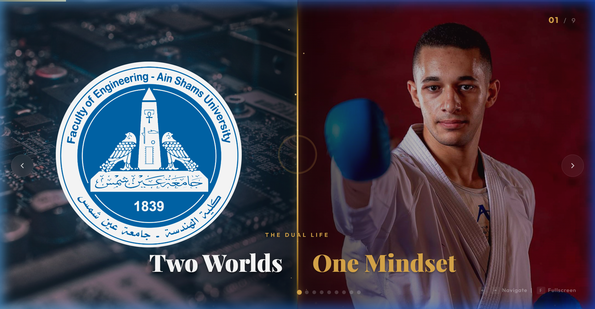

<p align="center">
  
</p>

<h1 align="center">🥋 My Karate Journey — A Story of Transformation</h1>

<p align="center">
  <em>A cinematic, interactive web presentation exploring the dual life of an engineer and a national karate champion.</em>
</p>

<p align="center">
  <a href="https://shawky2002020.github.io/My-Presentation/">
    
  </a>
  &nbsp;
  
  
  
</p>

---

## ✨ Overview

This is a **cinematic, fully interactive web-based presentation** that tells the personal story of balancing two demanding worlds — **engineering** and **competitive karate** — and turning that struggle into strength.

Built entirely with vanilla HTML, CSS, and JavaScript, the presentation features smooth slide transitions, ambient particle effects, responsive design, and a rich visual storytelling experience.

---

## 🎬 Slide Breakdown

| # | Title | Theme |
|:-:|:------|:------|
| 1 | **The Dual Life** — Two Worlds, One Mindset | Split-screen fusion of engineering & karate |
| 2 | **The Expectation** — Academic Pressure | Full-bleed childhood photo with overlay |
| 3 | **The Decision** — Why Not Me? | Split layout with personal competition photo |
| 4 | **The Breaking Point** — I Almost Gave Up | Emotional split layout |
| 5 | **The Struggle** — Zero Free Time | Text-heavy split with conflict imagery |
| 6 | **The Shift** — I Found Balance | Breakthrough moment with medal photo |
| 7 | **Real Outcomes** — From Medals To Mindset | Achievement grid with lesson cards |
| 8 | **Faith** — I Rely On Allah | Embedded personal video message |
| 9 | **Thank You** — OSS! 🤜 | Closing slide with inspirational quote |

---

## 🚀 Features

- **🎞️ Cinematic Transitions** — Smooth CSS-powered slide animations with entrance effects
- **✨ Particle System** — Ambient floating particles rendered on a canvas background
- **📱 Fully Responsive** — Adapts to desktop, tablet, and mobile screens
- **⌨️ Keyboard Navigation** — Arrow keys to navigate, `F` for fullscreen
- **👆 Touch & Swipe Support** — Swipe left/right on mobile devices
- **🎯 Progress Tracking** — Top progress bar + dot navigation
- **🎥 Embedded Video** — Personal video message with custom styling
- **🌗 Themed Slides** — Each slide has a unique color palette (crimson, ocean, steel, faith, etc.)
- **⏳ Animated Preloader** — Stylish loading screen before the story begins

---

## 🛠️ Tech Stack

| Technology | Usage |
|:-----------|:------|
| **HTML5** | Semantic slide structure |
| **CSS3** | Animations, gradients, glassmorphism, responsive layouts |
| **Vanilla JS** | Slide engine, keyboard/touch/wheel events, particles |
| **Google Fonts** | Outfit + Playfair Display |
| **Font Awesome 6** | Icons throughout the presentation |

---

## 📂 Project Structure

```
My-Presentation/
├── index.html          # Main presentation markup (9 slides)
├── style.css           # All styling, animations & responsive rules
├── script.js           # Presentation engine & particle system
├── images/
│   ├── faculty.png     # Ain Shams University logo
│   ├── personal-*.jpg  # Personal photos for each slide
│   ├── *.jpeg          # Additional personal media
│   └── *.mp4           # Embedded video content
└── README.md
```

---

## ⚡ Quick Start

1. **Clone the repository**
   ```bash
   git clone https://github.com/shawky2002020/My-Presentation.git
   cd My-Presentation
   ```

2. **Open in browser**
   ```bash
   # Simply open index.html in any modern browser
   open index.html
   ```
   > No build tools, no dependencies, no server required — just open and present!

3. **Navigate**
   - `←` `→` Arrow keys or click the side arrows
   - `F` to toggle fullscreen
   - Swipe on touch devices

---

## 🎨 Design Philosophy

This presentation was designed with a **cinematic storytelling** approach:

- **Dark, immersive backgrounds** to keep focus on the narrative
- **Gold accent color** (`#D4A843`) as a recurring motif for highlights and achievements
- **Split-screen layouts** to visually represent the duality of engineering & karate
- **Typography hierarchy** using Playfair Display for titles and Outfit for body text
- **Subtle motion** via CSS animations and canvas particles to create a living, breathing experience

---

## 📄 License

This project is open source and available for personal inspiration.

---

<p align="center">
  <strong>「 OSS! 🤜 」</strong><br/>
  <sub>A black belt is a white belt who never gave up.</sub>
</p>
